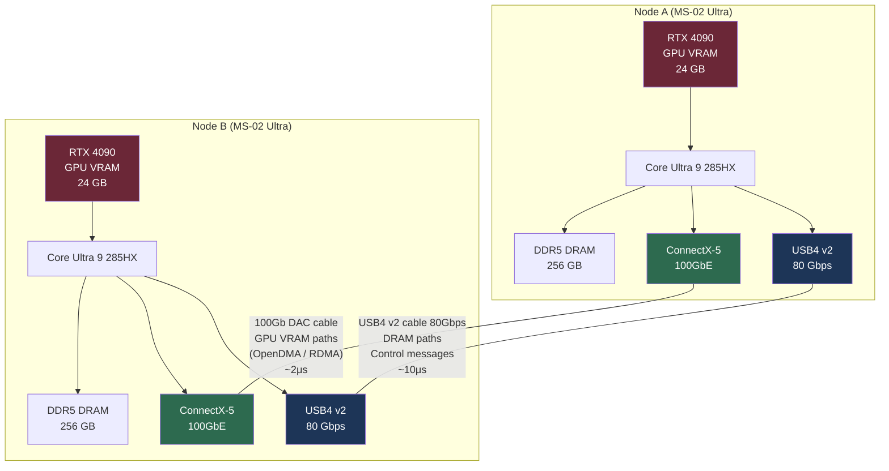

# R9: Multi-Transport Architecture - USB4, OCuLink, and ConnectX Complementarity

**Created:** 2026-03-24
**Last Updated:** 2026-03-24
**Status:** Draft
**Priority:** HIGH

## Purpose

Research USB4 and OCuLink as alternative and complementary transports to ConnectX RDMA for OuterLink, determine which transport handles which data path best, and establish a reference hardware configuration using the Minisforum MS-02 Ultra as a realistic multi-transport node.

---

## TL;DR

No single transport wins every workload. ConnectX-5+ owns GPU VRAM transfers (only NIC with a programmable DMA engine capable of targeting BAR1). OCuLink+NTB wins on raw bandwidth and sub-microsecond latency but is limited to ~1m same-desk setups. USB4 v2 covers DRAM-to-DRAM and control traffic with zero added hardware cost. The optimal OuterLink node runs all three simultaneously and routes each transfer type to its best path.

---

## 1. Why GPUs Cannot Do Network Transfers Alone

GPUs are **PCIe endpoint devices**. They respond to memory read/write requests issued by the root complex — they cannot initiate them. Consequences:

- No network stack exists on the GPU die
- No RDMA engine on the GPU
- GPU VRAM cannot "reach out" to the network fabric

Someone external must move the data: either the CPU (host-staged) or a DMA engine on a NIC (OpenDMA/GPUDirect). This is why the NIC choice determines which transfer modes are possible — not the GPU.

---

## 2. Why ConnectX-5 Specifically (Not Earlier Generations)

Three capabilities converged in ConnectX-5 that earlier cards lacked:

| Feature | CX-3 | CX-4 | CX-5 | CX-6 | CX-7 | BlueField-2/3 |
|---------|------|------|------|------|------|---------------|
| RDMA to host RAM | Yes | Yes | Yes | Yes | Yes | Yes |
| Programmable DMA engine | No | No | Yes | Yes | Yes | Yes |
| RDMA verb peer memory (`ibv_reg_mr` for PCIe physical addrs) | No | Maybe (untested) | Yes | Yes | Yes | Yes |
| PCIe peer-to-peer capability | No | No | Yes | Yes | Yes | Yes |
| Max link speed | 40/56Gb | 100Gb | 100Gb | 200Gb HDR | 400Gb NDR | 200/400Gb + ARM SoC |
| OpenDMA viable | No | Untested | Yes | Yes | Yes | Yes |

CX-3 and CX-4 could do RDMA to **host RAM** but their DMA engines could not target another device's BAR window. CX-5 introduced peer memory support: the NIC's DMA engine can hold a registered memory region backed by a PCIe physical address range (BAR1), making it the first generation capable of issuing Memory Write TLPs directly into GPU VRAM.

**Minimum viable: ConnectX-5. Preferred: ConnectX-6 (200Gb) or ConnectX-7 (400Gb) for headroom.**

---

## 3. USB4 as Alternative Transport

### What It Is

USB4 is a multi-protocol standard built on Thunderbolt 3 physical layer. It **tunnels PCIe traffic over cable** via a USB4 controller chip — meaning the PCIe transactions visible on one side are encapsulated, transmitted, and re-emitted on the other. The tunneling is handled by the controller, not exposed to software.

### Bandwidth

| Generation | Max Bandwidth |
|------------|--------------|
| USB4 v1 | 40 Gbps (~4 GB/s) |
| USB4 v2 | 80 Gbps (~8 GB/s) |
| USB4 v2 (bidirectional) | 80 Gbps each direction |

### Latency

~5–10 μs per transfer, due to protocol translation layers in the controller.

### The Core Problem for OpenDMA

USB4's PCIe tunneling is controller-managed. The endpoints on either side of the cable see a standard PCIe fabric from the root complex's perspective, but **raw PCIe BAR addresses from the remote side are not directly addressable** — the controller mediates all accesses and does not expose the physical BAR1 address of a GPU on the remote machine as a local PCIe physical address.

This means: a ConnectX-5 on Machine A cannot issue a PCIe Memory Write TLP that lands in GPU VRAM on Machine B when USB4 is the interconnect. The DMA engine has no path to the remote BAR1.

### What USB4 Is Good At

- Host DRAM to host DRAM transfers (tunneled PCIe memory-mapped IO or standard DMA)
- Control message passing (low-volume, latency-tolerant)
- Host-staged GPU transfers (host DRAM is reachable even if VRAM is not)
- Situations where no ConnectX hardware is available

### Verdict

USB4 is a solid fallback and complement for DRAM-tier transfers. It does not support zero-copy GPU VRAM transfers. It is already present on many modern mini-PCs at no added hardware cost, making it a free second channel when a ConnectX is also installed.

---

## 4. OCuLink as Alternative Transport

### What It Is

OCuLink is **raw PCIe over cable** — no encapsulation, no tunneling, no protocol translation. The PCIe lanes run straight through the cable connector as if the two ends were on the same motherboard. This is fundamentally different from USB4's tunneling approach.

### Bandwidth

PCIe 4.0 x4 = ~32 GB/s bidirectional (~256 Gbps). This exceeds ConnectX-6 and ConnectX-7.

### Latency

Sub-microsecond. There is no translation layer to add latency. PCIe TLPs propagate end-to-end as they would on a single board.

### The Core Problem: Root Complex Isolation

When two separate PCs are connected by OCuLink, each PC has its own root complex. Standard PCIe does not route TLPs across root complex boundaries — a CPU on Machine A cannot simply address memory on Machine B's PCIe fabric by issuing normal memory operations.

The solution is a **Non-Transparent Bridge (NTB)**. An NTB is a PCIe endpoint that presents a local BAR on each side and translates addresses across the boundary, making each side's memory space appear mapped in the other's address space.

- With NTB: CPU on Machine A can read/write GPU B's BAR1 directly — no NIC needed, no DMA engine needed beyond the CPU's own PCIe controller.
- NTB hardware options: dedicated NTB PCIe cards, or motherboards with NTB support in their PCIe root ports (rare, primarily server-class).
- OCuLink cables are ~1m maximum due to PCIe signal integrity constraints.

### Verdict

OCuLink+NTB is the highest-bandwidth, lowest-latency option for same-desk GPU pooling. Its constraints (1m cable, NTB hardware requirement, no network scalability) make it a complement to ConnectX rather than a replacement. Ideal for a dedicated 2-node local cluster.

---

## 5. Transport Comparison

| Property | ConnectX-5 RDMA | OCuLink + NTB | USB4 v2 |
|----------|-----------------|---------------|---------|
| Max bandwidth | 100 Gbps | ~256 Gbps | 80 Gbps |
| Latency | ~2 μs | <1 μs | ~10 μs |
| Max distance | Kilometers (fiber) | ~1 m | ~2 m |
| CPU bypass (DMA) | Yes | Partial (NTB CPU copy) | No |
| Zero-copy GPU VRAM | Yes (OpenDMA) | Yes (CPU can address BAR1) | No |
| Zero-copy host DRAM | Yes (RDMA) | Yes (NTB mapping) | No |
| NVIDIA driver restriction bypass | Via PCIe BAR1 patch | Via PCIe BAR1 direct | N/A |
| Hardware cost | ~$50/NIC used | ~$20 cable + NTB card | Built-in |
| Scalability | Any topology | Point-to-point only | Point-to-point only |
| Network stack needed | Yes (IB/RoCE) | No | No |
| OS NTB driver needed | No | Yes | No |

---

## 6. Reference Hardware: Minisforum MS-02 Ultra

The MS-02 Ultra is a mini-PC that happens to expose all three transport options simultaneously, making it an ideal OuterLink node for development and testing.

### Specifications Relevant to OuterLink

| Component | Spec | OuterLink Relevance |
|-----------|------|---------------------|
| CPU | Core Ultra 9 285HX | Strong single-thread, PCIe lane controller |
| Memory | Up to 256 GB DDR5, 4x SODIMM | 512 GB shared RAM across two nodes |
| Memory channels | Dual-channel | Bandwidth bottleneck (see §6.1) |
| Memory bandwidth | ~76.8 GB/s theoretical | Lower than server quad-channel (~150+ GB/s) |
| Primary PCIe slot | PCIe 5.0 x16 | GPU (RTX 4090 or similar) |
| Secondary PCIe slot | PCIe 4.0 x16 | Pre-installed Intel E810 25GbE NIC |
| Tertiary PCIe slot | PCIe 4.0 x4 | Free — ConnectX-5 target slot |
| OCuLink | Via bundled adapter card | Raw PCIe cable connection |
| USB4 front | 2x USB4 v2 (80 Gbps each) | DRAM tier transfers |
| USB4 rear | 1x USB4 v1 (40 Gbps) | Control/fallback |

### 6.1 Dual-Channel Memory Bandwidth Limitation

The MS-02 Ultra uses a dual-channel DDR5 memory controller, providing approximately 76.8 GB/s theoretical peak bandwidth. Server platforms typically offer quad-channel at 150+ GB/s. This matters for host-staged GPU transfers:

```
Host-staged path:
GPU VRAM -> PCIe -> pinned RAM -> network -> pinned RAM -> PCIe -> GPU VRAM
                       ^^^^                    ^^^^
              Both these stages hit the memory controller
```

At 76.8 GB/s peak, with two simultaneous GPU↔RAM transfers (one read, one write), memory bandwidth becomes the bottleneck before the network even saturates.

**Consequence: this limitation makes OpenDMA and USB4 direct paths MORE important, not less.** When data bypasses host RAM entirely (OpenDMA via BAR1, or USB4 DRAM-mapped transfers), the memory controller bottleneck disappears. The hardware constraint is an argument for investing in zero-copy paths.

### 6.2 PCIe Lane Budget

```
GPU (RTX 4090):         PCIe 5.0 x16  → 128 GB/s
Intel E810 (25GbE):     PCIe 4.0 x16  → 32 GB/s (NIC uses ~x4 internally)
ConnectX-5 (100GbE):    PCIe 4.0 x4   → 16 GB/s (well-matched to NIC throughput)
NVMe drive(s):          PCIe 4.0 x4   → 16 GB/s
```

No slot starvation under this allocation. The ConnectX-5 100GbE NIC peaks at ~12.5 GB/s, which fits comfortably in a x4 slot.

---

## 7. Three Memory Pools OuterLink Exposes

Regardless of transport, OuterLink virtualizes three tiers of memory on each remote node:

| Pool | Physical Location | Access Method | Typical Latency |
|------|------------------|---------------|-----------------|
| Remote VRAM | GPU on-board HBM/GDDR6X | OpenDMA (BAR1 DMA) or host-staged cudaMemcpy | ~2μs (OpenDMA) / ~50μs (staged) |
| Remote DRAM | Host DDR5 system RAM | RDMA (ConnectX), USB4, or TCP | ~2μs (RDMA) / ~10μs (USB4) |
| Remote Pinned RAM | CUDA-pinned host pages | Same as DRAM, but non-pageable | Same as DRAM; preferred staging buffer |

Remote Pinned RAM is the preferred intermediary for host-staged paths because CUDA guarantees it will never be paged out and its physical address is stable — the NIC DMA engine can hold a reliable registered memory region against it.

---

## 8. Multi-Transport Distribution Strategy

When a ConnectX-5 AND USB4 v2 are both present (the MS-02 Ultra configuration), each transfer type should be routed to its optimal path:

| Transfer Type | Optimal Transport | Rationale |
|---------------|------------------|-----------|
| GPU VRAM ↔ remote GPU VRAM | ConnectX-5 (OpenDMA) | Only transport with a DMA engine that can target BAR1 |
| GPU VRAM ↔ remote DRAM | ConnectX-5 | DMA engine handles both BAR1 and registered host memory |
| DRAM ↔ remote DRAM (bulk) | USB4 v2 | Lower latency than RDMA setup cost for same-machine DRAM hops; no NIC overhead |
| DRAM ↔ remote DRAM (small) | USB4 v2 | Control path; RDMA queue pair setup overhead not worth it for small messages |
| Control messages (<4KB) | USB4 v2 | Lower effective latency, no IB connection management overhead |
| Bulk streaming (large, sustained) | Both — stripe across links | ~180 Gbps aggregate (100Gb ConnectX + 80Gb USB4) |

### Striped Transfer Example

For a 1 GB GPU-to-DRAM transfer on a dual-link node:

```
1 GB total
├── 550 MB → ConnectX-5 path (GPU VRAM → NIC DMA → remote pinned RAM)
└── 450 MB → USB4 v2 path   (host-staged: GPU → local pinned RAM → USB4 → remote DRAM)

Effective aggregate: ~180 Gbps = ~22.5 GB/s
vs. single ConnectX-5 only: ~12.5 GB/s
```

This requires a multi-path scheduler in OuterLink's transport layer that understands link capacities and transfer type constraints (USB4 cannot own the VRAM side directly, only after staging).

---

## 9. Dual-Transport Architecture: Two MS-02 Ultra Nodes



### Path Annotations

**Green path (ConnectX-5):** GPU VRAM transfers via OpenDMA. ConnectX DMA engine issues PCIe Memory Write TLPs to remote GPU's BAR1. Also handles RDMA for host DRAM when throughput > USB4 capacity.

**Blue path (USB4 v2):** DRAM-tier transfers and all control traffic. No DMA engine involvement required. Routes small messages and bulk DRAM streaming in parallel with the green path.

---

## 10. Practical Cost for Two-Node MS-02 Ultra Cluster

| Item | Qty | Estimated Cost |
|------|-----|---------------|
| Minisforum MS-02 Ultra (bare, no GPU) | 2 | ~$1,800 total |
| RTX 4090 (used) | 2 | ~$1,600 total |
| ConnectX-5 100GbE single-port (used) | 2 | ~$100 total |
| DAC direct attach copper cable (100Gb) | 1 | ~$30 |
| USB4 v2 cable (1m, certified) | 1 | ~$20 |
| Total | | **~$3,550** |

For comparison: two A100 nodes with NVLink would exceed $100,000. This configuration delivers ~48 GB pooled VRAM, ~512 GB pooled DRAM, ~22.5 GB/s peak inter-GPU bandwidth, at under $4k.

---

## Related Documents

- `planning/research/CONSOLIDATION-all-research.md` — synthesis of all prior research; transport choices in context
- `planning/research/R4-connectx5-transport-stack.md` — ConnectX-5 capabilities; established why CX-5 is minimum viable
- `planning/research/R7-non-proprietary-gpu-dma.md` — PCIe BAR1 OpenDMA mechanism; basis for why ConnectX owns GPU VRAM transfers
- `planning/pre-planning/02-FINAL-PREPLAN.md` — final pre-plan; transport layer is Phase 1 deliverable
- `planning/pre-planning/03-contingency-plans.md` — Plan B/C/D; USB4 maps to Plan B (host-staged over USB4)
- `docs/architecture/00-project-vision.md` — project vision; multi-transport aligns with Phase 5 OpenDMA goals

---

## Open Questions

| # | Question | Priority | Status |
|---|----------|----------|--------|
| OQ-1 | Can USB4 v2's PCIe tunneling expose remote BAR1 physical addresses for direct ConnectX DMA? (would unlock zero-copy over USB4) | HIGH | Unresolved — needs hardware testing |
| OQ-2 | What NTB hardware options exist for OCuLink bridging between two separate root complexes? Are consumer-grade NTB cards available? | MEDIUM | Unresolved — needs component research |
| OQ-3 | Can Arrow Lake's USB4 controller sustain full 80 Gbps bidirectional under real load (PCIe tunneling overhead)? | HIGH | Unresolved — needs benchmarking on MS-02 Ultra |
| OQ-4 | Multi-path scheduler design: what algorithm optimally splits transfers across heterogeneous links given per-transfer type constraints? | HIGH | Unresolved — design work needed in Phase 1 transport layer |
| OQ-5 | Does the pre-installed Intel E810 25GbE NIC support any PCIe peer-to-peer features that OuterLink could leverage as a third transport? | LOW | Unresolved — check E810 datasheet / Linux driver |
| OQ-6 | What is the measured impact of dual-channel DDR5 on host-staged transfer throughput vs. theoretical 76.8 GB/s peak? Specifically: does it bottleneck before the 100Gb ConnectX saturates? | HIGH | Unresolved — requires benchmark |
| OQ-7 | PCIe lane allocation: with GPU (x16) + ConnectX (x4) + NVMe + E810 active simultaneously, do any devices get reduced lane width or throttled? | MEDIUM | Unresolved — needs BIOS/PCIe topology check on MS-02 Ultra |
| OQ-8 | Riser card requirements: does fitting a ConnectX-5 into the MS-02 Ultra's free x4 slot require a low-profile bracket or specific riser? What are the physical compatibility constraints? | MEDIUM | Unresolved — needs mechanical check |
| OQ-9 | For the striped transfer strategy, how does OuterLink detect available transports at startup and fall back gracefully when one is absent? | HIGH | Unresolved — transport negotiation protocol design needed |
